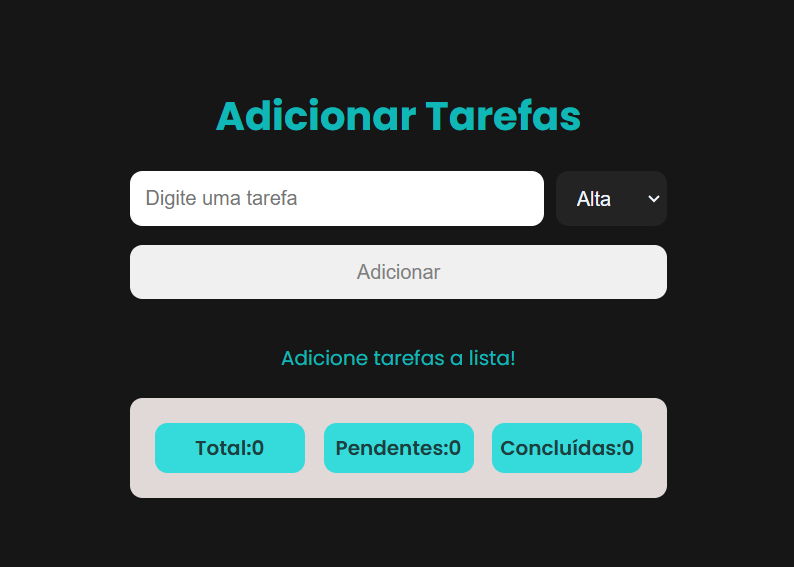
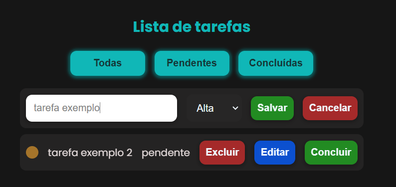
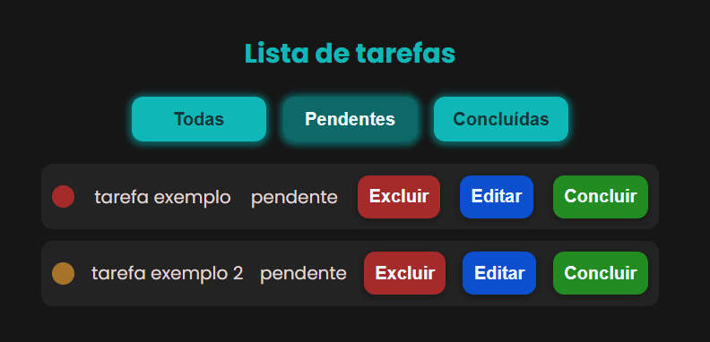

# Gerenciador de Tarefas

Gerenciador de tarefas desenvolvido em JavaScript puro, com foco em modularização do código, organização da aplicação e persistência de dados utilizando LocalStorage.

## Preview do Projeto

| Tela inicial | Editando tarefa | Filtro de tarefas |
|-------------|-----------------|------------------|
|  |  |  |

## Funcionalidades

- Adicionar novas tarefas com nível de prioridade
- Editar tarefas existentes
- Excluir tarefas
- Marcar tarefas como concluídas
- Desfazer a marcação de tarefas concluídas
- Filtrar tarefas por status (todas, pendentes e concluídas)
- Ordenar tarefas por nível de prioridade
- Validação de erros (campo vazio e tarefas duplicadas)
- Contador de tarefas totais, concluídas e pendentes
- Persistência de dados utilizando LocalStorage
- Organização do código utilizando módulos ES6
  
## Estrutura do projeto

O projeto foi organizado utilizando módulos ES6, separando responsabilidades para facilitar manutenção, leitura e escalabilidade do código.

📁 gerenciador-de-tarefas  
├── index.html → Estrutura da aplicação  
├── style.css → Estilização da interface  

📁 js  
├── dados.js → Armazena e exporta o estado da aplicação (lista de tarefas, status e prioridades)  
├── localStorage.js → Responsável pela persistência dos dados no navegador  
├── ui.js → Manipulação do DOM e renderização das tarefas  
├── tarefas.js → Regras de negócio (manipulação das tarefas)  
├── main.js → Ponto de entrada da aplicação (inicialização e renderização)

## Tecnologias Utilizadas

- **HTML5** → Estruturação semântica da aplicação  
- **CSS3** → Estilização da interface e responsividade  
- **JavaScript (ES6+)** → Lógica da aplicação, manipulação do DOM e controle de estado  
- **Módulos ES6** → Organização e separação de responsabilidades no código  
- **LocalStorage** → Persistência dos dados no navegador

## Aprendizados

Durante o desenvolvimento deste projeto, foi possível consolidar conceitos importantes de JavaScript e organização de código, indo além da simples **manipulação do DOM**.

Aprendi a estruturar uma aplicação utilizando **módulos ES6**, separando responsabilidades entre regras de negócio, manipulação da interface e persistência de dados, o que tornou o código mais legível e fácil de manter.

Também aprofundei meu entendimento sobre **controle de estado**, trabalhando com uma lista central de tarefas que é atualizada de forma consistente entre a interface, as regras de negócio e o LocalStorage.

Outro aprendizado importante foi a implementação de **validações**, como impedir tarefas vazias ou duplicadas, além de tratar corretamente diferentes fluxos da aplicação (adição, edição, exclusão e conclusão de tarefas).

Por fim, aprendi a integrar **LocalStorage** ao fluxo da aplicação, garantindo que os dados fossem persistidos mesmo após recarregar a página, e a pensar na aplicação como um sistema completo, desde a entrada do usuário até a renderização final.

## Como rodar o projeto

 **Acesse o projeto:**  
https://anaolr.github.io/gerenciador-de-tarefas/

---
Projeto desenvolvido para fins de estudo e prática de JavaScript moderno, organização de código e lógica de aplicações front-end.

